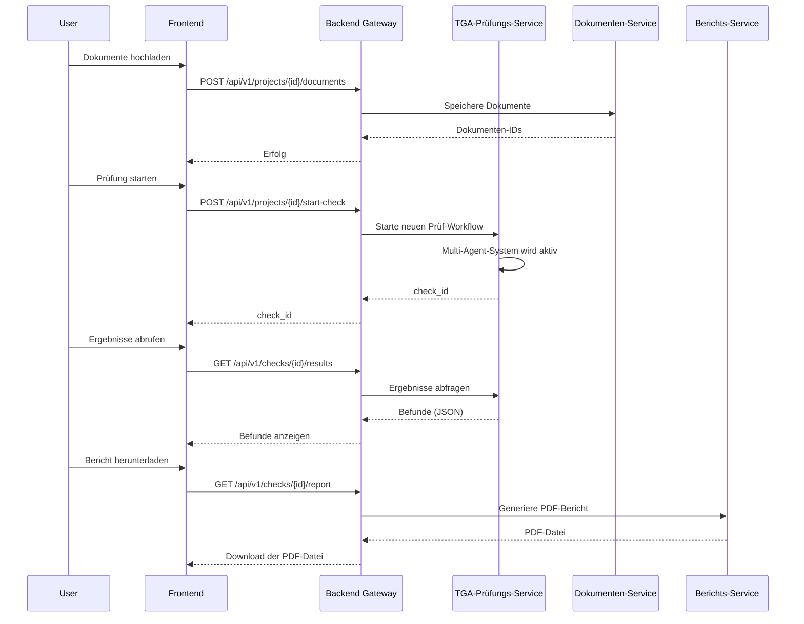

# Multi-Agent-Architektur und Microservice-Design

## 1. Systemarchitektur: Microservice-Ansatz

Die TGA-KI-Plattform wird als eine lose gekoppelte, microservice-basierte Architektur konzipiert. Dieser Ansatz bietet maximale Flexibilität, Skalierbarkeit und Wartbarkeit. Jeder Microservice ist für eine spezifische Geschäftsfunktion verantwortlich und kommuniziert mit anderen Services über eine gut definierte API.

### Hauptkomponenten der Architektur:

*   **Frontend (React/TypeScript):** Die Benutzeroberfläche für Projektmanagement, Dokumenten-Upload und Ergebnisvisualisierung.
*   **Backend-Gateway (FastAPI):** Der zentrale Einstiegspunkt für alle API-Anfragen. Leitet Anfragen an die entsprechenden Microservices weiter und aggregiert deren Antworten.
*   **TGA-Prüfungs-Service (FastAPI):** Orchestriert den gesamten Prüfprozess. Hier ist das Multi-Agent-System angesiedelt.
*   **Dokumenten-Service (FastAPI):** Verantwortlich für das Speichern, Verwalten und Versionieren von TGA-Dokumenten.
*   **Berichts-Service (FastAPI):** Generiert PDF-Prüfberichte und andere Auswertungen.
*   **Datenbank (PostgreSQL):** Die zentrale Datenhaltung für alle Services.

## 2. Multi-Agent-System: Detailliertes Design

Das Herzstück des TGA-Prüfungs-Service ist ein Multi-Agent-System, das auf dem im `tga_coordinator.py` skizzierten Konzept aufbaut. Jeder Agent ist ein spezialisierter Microservice oder ein autonomer Prozess, der eine spezifische Prüfaufgabe übernimmt.

### Agenten-Typen und ihre Aufgaben:

| Agenten-Typ | Aufgaben | Technologien/Methoden |
| :--- | :--- | :--- |
| **TGA Coordinator Agent** | - Orchestriert den gesamten Prüfworkflow - Delegiert Aufgaben an spezialisierte Agents - Führt Ergebnisse zusammen und bewertet sie | - Asynchrone Aufgabenverteilung (Celery, RabbitMQ) - Zustandsmanagement (Finite State Machine) |
| **Document Intake Agent** | - Klassifiziert Dokumente nach Typ und Gewerk - Extrahiert Metadaten aus Planköpfen (OCR) - Führt Planlisten-Abgleich durch | - OCR (Tesseract, Google Vision API) - Regex, NLP für Klassifizierung |
| **Formal Compliance Agent** | - Prüft auf formale Vollständigkeit nach VDI 6026 - Validiert Legenden, Beschriftungen und Plankopf-Daten | - Regelbasiertes System - Text- und Strukturanalyse |
| **Trade-Specific Expert Agents** | - Führen gewerkespezifische Fachprüfungen durch - KG410 Sanitär, KG420 Heizung, KG430 Lüftung, etc. | - Spezialisierte Regelwerke pro Gewerk - Anbindung an externe Berechnungs-Tools |
| **Cross-Discipline Coordination Agent** | - Prüft auf gewerkeübergreifende Kollisionen - Analysiert Schnittstellen (z.B. Elektro-Heizung) - Validiert die Schlitz- und Durchbruchsplanung (SuD) | - Geometrische Analyse (optional mit DWG/IFC) - Graphen-basierte Schnittstellenanalyse |
| **Reporting Agent** | - Generiert strukturierte Prüfberichte - Erstellt Visualisierungen und Zusammenfassungen | - ReportLab, WeasyPrint für PDF-Generierung - Datenvisualisierungs-Bibliotheken |

## 3. API-Design und Datenfluss

Die Kommunikation zwischen den Services erfolgt über REST-APIs. Der Datenfluss ist klar definiert, um einen robusten und nachvollziehbaren Prüfprozess zu gewährleisten.

### API-Endpunkte (Beispiele):

*   `POST /api/v1/projects`: Neues TGA-Projekt anlegen.
*   `POST /api/v1/projects/{project_id}/documents`: Dokumente zu einem Projekt hochladen.
*   `POST /api/v1/projects/{project_id}/start-check`: Eine neue Prüfung starten.
*   `GET /api/v1/checks/{check_id}/status`: Den Status einer laufenden Prüfung abfragen.
*   `GET /api/v1/checks/{check_id}/results`: Die Ergebnisse einer abgeschlossenen Prüfung abrufen.
*   `GET /api/v1/checks/{check_id}/report`: Den PDF-Prüfbericht herunterladen.

### Datenfluss-Diagramm:

## 4. Technologie-Stack

| Komponente | Technologie | Begründung |
| :--- | :--- | :--- |
| **Backend** | Python, FastAPI | Hohe Performance, asynchrone Verarbeitung, einfache API-Erstellung |
| **Frontend** | React, TypeScript | Moderne, komponentenbasierte UI-Entwicklung, Typsicherheit |
| **Datenbank** | PostgreSQL | Robust, skalierbar, unterstützt komplexe Abfragen und JSON-Daten |
| **Message Queue** | RabbitMQ | Zuverlässige Kommunikation zwischen Microservices und Agenten |
| **Containerisierung**| Docker, Docker Compose | Einfache Bereitstellung, konsistente Entwicklungsumgebung |
| **CI/CD** | GitHub Actions | Automatisierte Tests und Deployments |

